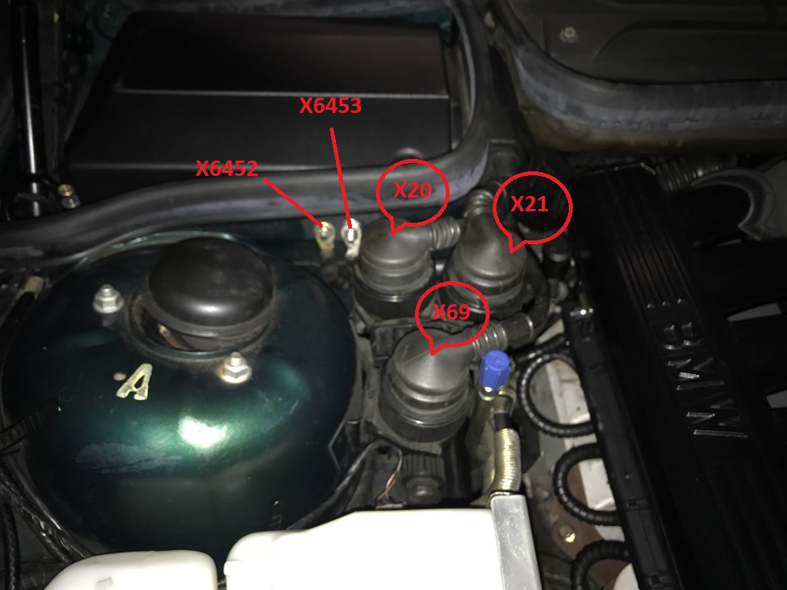
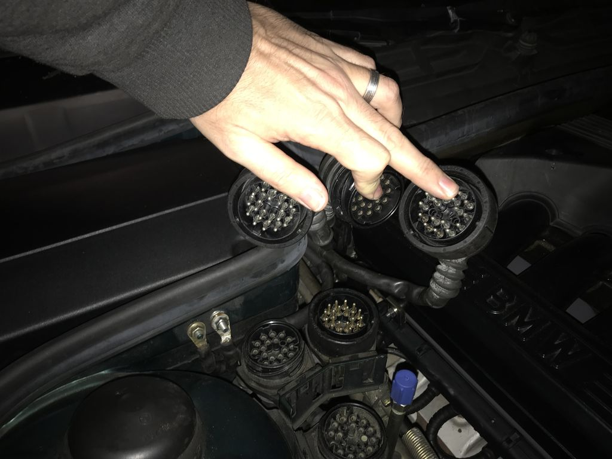

# M70 @ rusEFI Proteus F7 #

## BMW E31 main connectors between car and engine harness ##

- [Powertrain logical signals](./hardware/power_train.md)
- [D100 pinout, diagnostic connector](./hardware/d100.md)
- [X20 pinout, male on engine harness side](./hardware/x20.md)
- [X21 pinout, female on engine harness side](./hardware/x21.md)
- [X69 pinout, male on engine harness side](./hardware/x69.md)

### Hardware used by rusEFI Proteus to running BMW M70 engine ###

- [Wire colors](./hardware/wire_colors.md)
- [Wire current](./hardware/wire_current.md)
- [Trigger settings](./hardware/trigger_settings.md)
- [Proteus pinout for M70](./hardware/Proteus_pinout.md)
- [Lua](./hardware/lua.md)

#### Sensors ####

- [Temperature sensors](./hardware/temperature_sensors.md)
- [Crank and cam sensors](./hardware/crank_cam_sensors.md)
- [MAF sensors](./hardware/maf_sensors.md)
- [MAP sensors, not used](./hardware/map_sensor.md)
- [PPS](./hardware/pps.md)
- [Speed sensor](./hardware/speed_sensor.md)

#### Actuators ####

- [Ignition coils](./hardware/ignition_coils.md)
- [Injectors](./hardware/injectors.md)
- [ETB](./hardware/etb.md)
- [plugs and pins](./hardware/plugs_pins.md)
- [relays](./hardware/relays.md)

#### Peripherie ####

- [Starter](./hardware/starter.md)
- [Tacho](./hardware/tacho.md)
