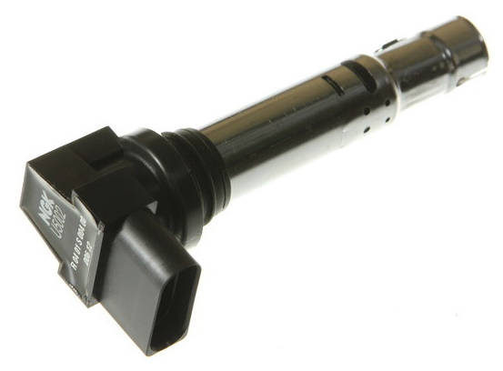

## BMW "coil on plug" coils: ## 
- 1213 1748017 (Bremi 11860T)
- used on BMW M62/S62 engines
- dump coil, needs ignition driver, i.e. ISL9V3040P3

Dwell times:
|Volt, V|Dwell, ms|
|:------|:--------|
|8|7.4|
|10|4.8|
|12|3.4|
|13.2|3.0|
|14|2.7|
|16|2.3|

## NGK "coil on plug" coils: ## 

### NGK short version ###
- 48003: black head
- overall length: 140mm

Pinout:
|Pin#|Label|Description|
|:----|:-----|:-----------|
|1|GND|Power Ground?|
|2|GND|ECU Ground?|
|3|+12V|Power|
|4|+5V|TTL, ignition signal from ECU|

### NGK normal version ###
- 48005: black head
- overall length: 165mm

Pin out:
|Pin#|Label|Description|
|:----|:-----|:-----------|
|1|+12V|Power|
|2|GND|ECU Ground?|
|3|+5V|TTL, ignition signal from ECU|
|4|GND|Power Ground?|

### NGK long version ###
- 48041: red head
- 48042: black head
- overall length: 178mm

Pin out:
|Pin#|Label|Description|
|:----|:-----|:-----------|
|1|+12V|Power|
|2|GND|ECU Ground?|
|3|+5V|TTL, ignition signal from ECU|
|4|GND|Power Ground?|

info source: 
- https://www.maxxecu.com/webhelp/wirings-connector_pinouts-ignition_coils.html
- https://www.skyline-forum.de/forum/nissan-skyline/sonstiges-aa/27138-audi-z%C3%BCndspulen-im-skyline
- http://auditurboforum.de/chiptuning-und-elektrik/zundanlage-im-aan-macht-erneut-probleme
