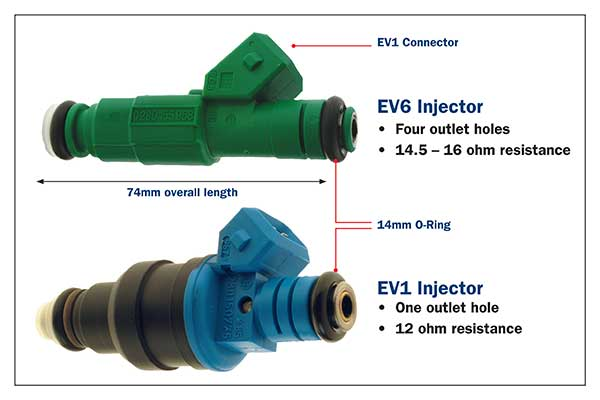

### BMW M70B50 engine injectors ###

Pinout
|Pin #|Signal|
|-----|------|
|1|-, lowside switch|
|2|+, common UBat|

Plug:
- Housing: BMW 12521732460
- Pins: 

M70 original Bosch injector (I'm using this):
- Number: 0280150715 (0 280 150 715)
- Type: EV1
- Resistance (Ohm): 15.9
- Pressure (kPa/Bar): 300/3
- Q-Stat at 300kPa (g/min): 116.5
- Q-Stat at 300kPa (ml/min): 166
- Spray type: A (one outlet hole)
- total length: 74mm

Alternative Bosch injector (new part)
- Number: 0280156346 (0 280 156 346)
- Type: EV6
- Resistance (Ohm): 15.95
- Pressure (kPa/Bar): 300/3
- Q-Stat at 300kPa (g/min): 117
- Q-Stat at 300kPa (ml/min): 167
- Spray type: C (four outlet holes)
- total length: 74mm

