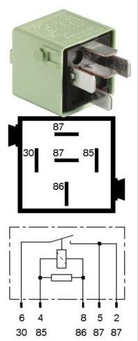

# Fule pump relay 2 K211 #

## Fuel pump relay bank 2 ##

- coil resistance ....
- white green
- make contact
- BMW number 6136 8373700

Terminals

- terminal 30
  - from B+
  - RT 2.5mm²
- terminal 86
  - DME relay 2, terminal 87
- terminal 85
  - 0.5mm²
  - from proteus "fuel pump"
- terminal 87 (pin 2)
  - X21.12, 1.5mm² GN/GR