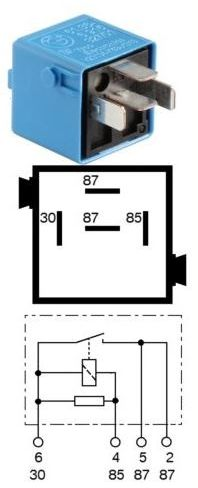

# DME relay 1 K6810 #

## DME relay bank 1 ##

- coil resistance 95ohm
- sky blue
- make contact
- BMW number 6136 6915327

Terminals

- terminal 30
  - from B+
  - RT 4.0mm²
- terminal 85
  - 0.5mm²
  - from proteus "main relay output"
- terminal 87 (pin 5)
  - 30A fuse, 2.5mm² RT/WS
    - proteus main power input (Black24.23)
    - bank 1 injectors (cylinder 1-6)
    - bank 1 HFM power supply
- terminal 87 (pin 2)
  - 20A fuse, 2.5mm² RT/WS
    - bank 1 ignition coil
    - bank 1 evaporative emission valve
    - bank 1 fuel relay, terminal 86
