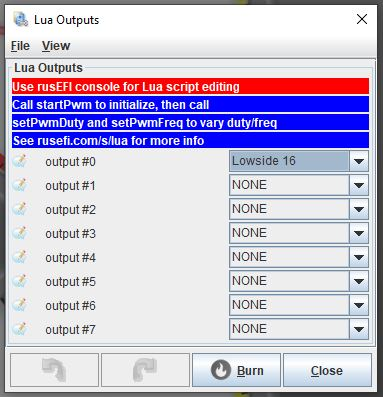

# Lua on rusEFI Proteus

### As of 2021 rusEFI uses a popular open source Lua scripting engine.
### Some ECUs (EGS, ABS/ASC) in my BMW 8-series need a PWM (100Hz) modulated throttle position signal to work error free. Lua gives us the possibility to realize it.

How is Lua configured now? Here are the necessary steps:
- assign output
- set PWM frequency and initial duty cycle
- update duty cycle in event

### Assign Lua output, go for "Advanced" -> "Lua Script PWM Outputs":



### set PWM frequency and initial duty cycle

```Lua
startPwm(0, 100, 0) -- starts PWM on output #0 (check TunerStudio) with 100Hz and initial duty cycle o 0%
```

### update duty cycle in event

```Lua
function onTick()
    tps1 = getSensor("Tps1") -- get actual value of Tps1
    print('pedal position: ' ..tps1) -- do some output
    pedalDutyCycle = tps1 / 100
    setPwmDuty(0, pedalDutyCycle) -- set duty cycle. the correct value is between 0 (= 0%) and 1 (100%)
end
```