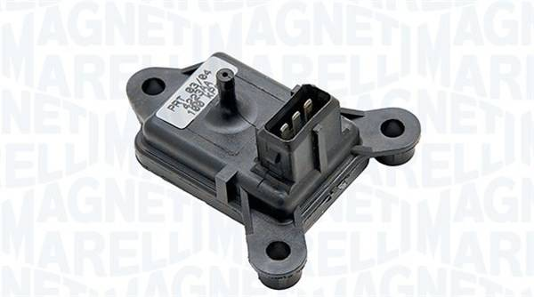

# MAP (Manifold Absolute Pressure sensor) #

Why MAP sensor, if MAF sensors are installed? [Check this](./maf_sensors.md)

Suitable MAP sensors for BMW M70 engine:

|Manufactor|Part number|Measurement range [bar] / [kPa]|Supply voltage|Output voltage range[mV]|Connector|
|:---------|:---------|:---------|:---------|:---------|:---------|
|Bosch|0 261 230 004|0.2 - 1.05 / 20 - 105|5.0|445 - 4674|3-pin JPT (i.e. 12521706068)|
|Facet|10.3015|0.2 - 1.05 / 20 - 105|5.0|445 - 4674|3-pin JPT (i.e. 12521706068)|
|Magneti Marelli|215810001604|0.17 - 1.05 / 17 - 105|5.0|250 - 4750|3-pin JPT (i.e. 12521706068)|
|Facet|10.3003|0.17 - 1.05 / 17 - 105|5.0|250 - 4750|3-pin JPT (i.e. 12521706068)|
|Bosch|0 281 002 593|0.125 - 2.557 / 12.5 - 255.7|5.0|250 - 4750|1 928 403 110 / 1928402868 / D 261 205 335|
|Facet|10.3122|0.125 - 2.557 / 12.5 - 255.7|5.0|250 - 4750|1 928 403 110 / 1928402868 / D 261 205 335|

- Pinout 0 261 230 004:

|Pin|Name|
|:-----|:-----|
|1|Vsupply (4.75 ... 5.25v, 16v max)|
|2|GND|
|3|Signal output|

Bosch 0 261 230 004 / Facet 10.3015 and compatible:

Magneti Marelli 215810001604 / Facet 10.3003 and compatible:

Bosch 0 281 002 593 / Facet 10.3122 and compatible:

