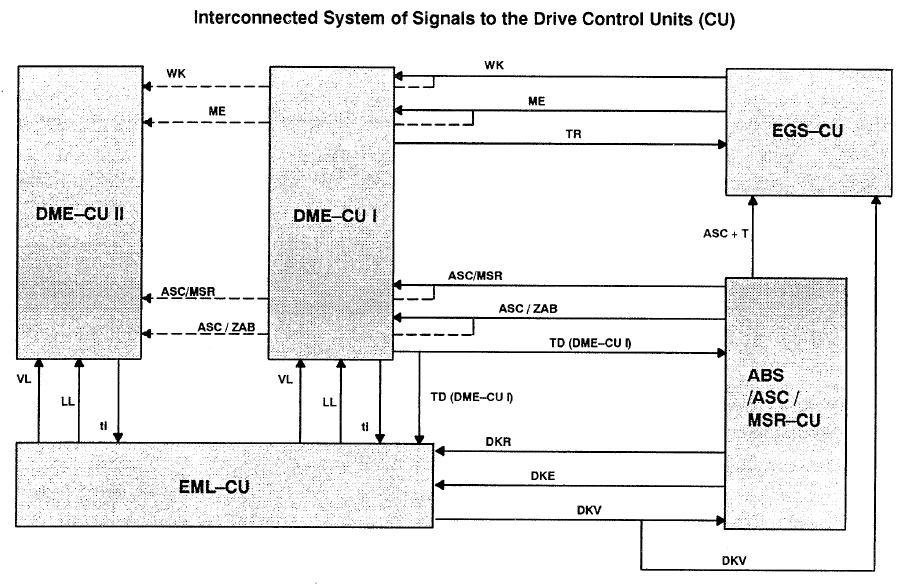

# Powertrain diagramm and logical signals

|Signal|Signal description|Type of signal|Effect|Proteus relevant|
|------|--------------|--------------|--------------|---------|
|WK|Torque converter clutch|GND = torque converter clutch engaged (ON)|DME selects corresponding characteristics map|No|
|ME|Engine intervention (ignition angle intervention)|Ground = ON|DME reduces torque during the gearshift procedure (ignition timing retarded)|Mandatory|
|TR|Engine speed signal (3 timer pulses per crankshaft revolution)|Square-wave voltage|EGS receives information relating to the engine speed|Mandatory|
|ASC/MSR|Automatic stability control or engine drag torque control|U-Bat|2 functions within DME control unit: complete torque cut-off if currently active (MSR) Otherwise, ignition timing set towards retard (ASC)|Optional|
|ASC/ZAB|Automatic stability control, ignition fade out|U-Bat|DME fades out the ignition and fuel injection (not in ASC+T)|Optional|
|TD|Engine speed signal (once per ignition cycle)|Square-wave signal|EML undertakes idle control and engine speed limitation. ASC requires this information to ensure it does not stall the engine. Instrument cluster requires this signal for tachometer. |Mandatory|
|ASC+T|Automatic stability control + traction|U-Bat = ON|With ASC+T is active, EGS prevents alternate gearshifts in transmission.|No|
|DKR|Throttle reduction|Square-wave voltage with fixed frequency and variable duty factor|EML reduces throttle opening angle|Optional|
|DKE|Throttle increase|Square-wave voltage with fixed frequency and variable duty factor|EML increases throttle opening angle|Optional|
|DKV|Set throttle value|Square-wave voltage with fixed frequency and variable duty factor|ASC/MSR receives information on the current status of pedal position sensor (driver requirement)|Mandatory   [Lua](./lua.md)|
|LL|Idle signal|Ground = ON|DME selects corresponding characteristics map|No|
|VL|Full load signal|Ground = ON|DME selects corresponding characteristics map|No|
|ti|Injection signal|Square-wave voltage|EML synchronises the throttle valves|No|
