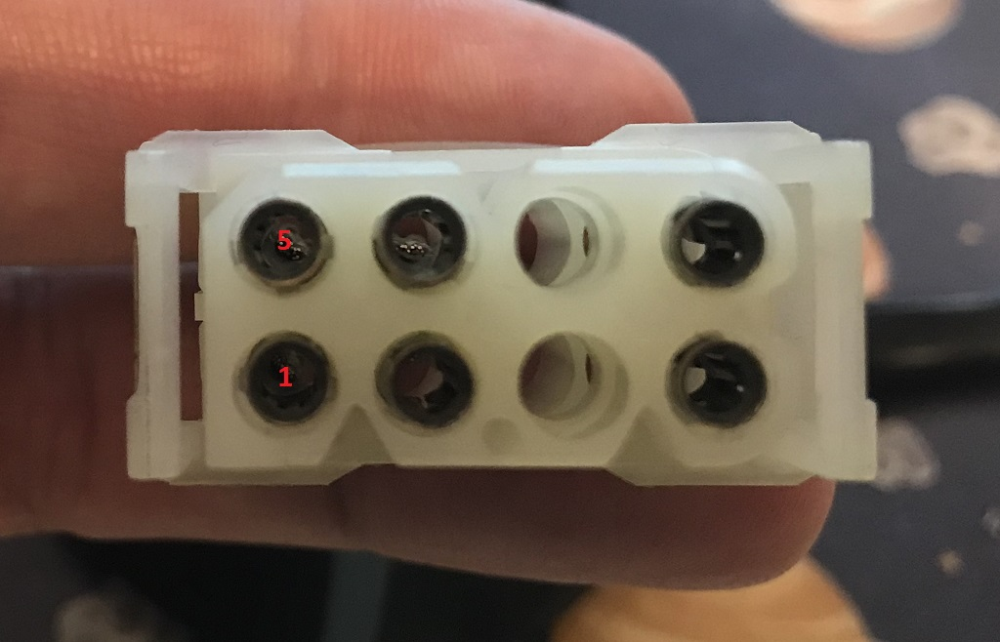

# BMW M70 pedal position sensor PWG #

## Original pedal position sensor PPS ##

- Voltage: approx. 0.4V to 4V, depends on pedal angle

### PPS pinout ###

|Pin#|Function|Description|
|:---|:----------|:-------|
|1|Pedal position|connected to EML, Pin 7 via X21.6|
|2|||
|3|||
|4|Sensor ground (SGND)|connected to EML, Pin 2 via X21.9|
|5|||
|6|Pedal position angle >9° switch|connected to EML, Pin 46 via X21.10|
|7|Sensor poti power (5V)|connected to EML, Pin 9 via X21.6|
|8|Sensor switch power (5V)|connected to EML, Pin 1 via X21.7|

## For Proteus suitable PPW (1712009) ##

For Proteus we need a PPS with two independant signals/sensors

|Pin#|Function|Description|
|:---|:----------|:-------|
|1|Sensor 1 signal output||
|2|Sensor 2 power (+5V)||
|3|||
|4|Sensor 2 ground||
|5|Sensor 2 signal output||
|6|Sensor 1 power (+5V)||
|7|||
|8|Sensor 1 ground||
