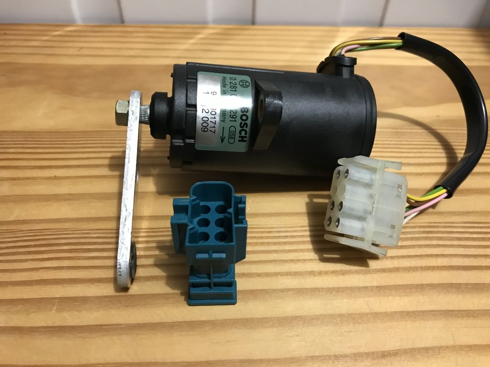
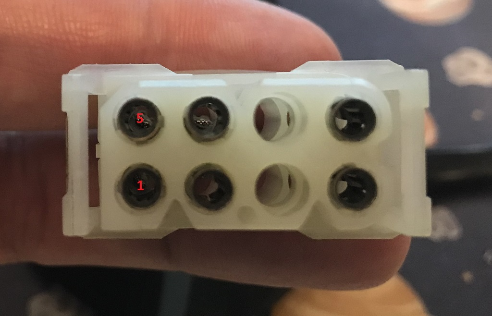
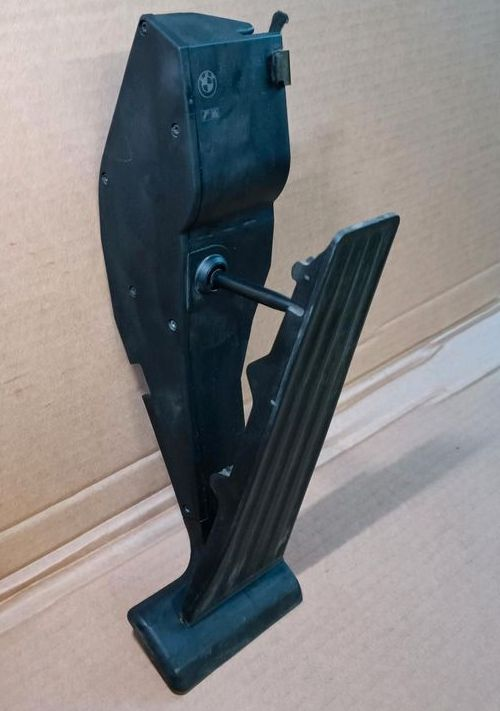
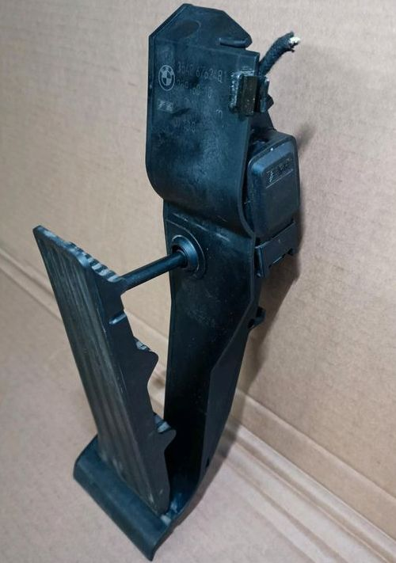
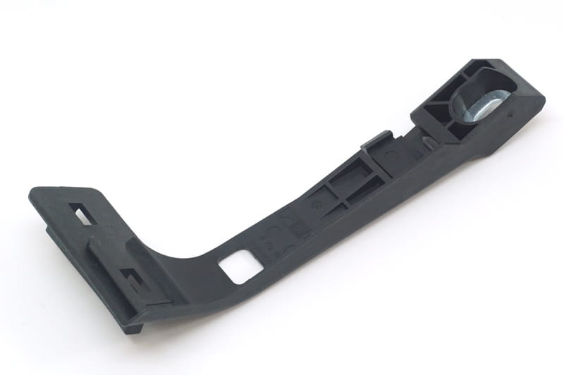

# BMW M70 pedal position sensor PWG #

## Original pedal position sensor PPS ##

- Voltage: approx. 0.4V to 4V, depends on pedal angle

### PPS pinout X73, male on pps side ###

|Pin#|Function|Description|
|:---|:----------|:-------|
|1|Pedal position output|connected to EML, Pin 7 via X21.1|
|2|5v pull up for pin 3|connected to DME2, pin 62 via X21.6|
|3|accelerator pedal released / depressed switch|connected to ground|
|4|Sensor ground (SGND)|connected to EML, Pin 2 via X21.4|
|5|5v pull up for pin 3|connected to DME1, pin 62 via X21.15|
|6|Pedal angle >9°|connected to EML, Pin 46 via X21.5|
|7|Sensor power (5V)|connected to EML, Pin 9 via X21.3|
|8|Switch power (5V)|connected to EML, Pin 1 via X21.2|

## For Proteus suitable PPW (1712009) ##

For Proteus we need a PPS with two independant signals/sensors, i.e. Bosch 0 281 002 291:

|Pin#|Function|Description|
|:---|:----------|:-------|
|1|Sensor 1 signal output||
|2|Sensor 2 power (+5V)||
|3|||
|4|Sensor 2 ground||
|5|Sensor 2 signal output||
|6|Sensor 1 power (+5V)||
|7|||
|8|Sensor 1 ground||

## alternative part: acceleration pedal module (3542 6762481) ##

Adapter plate

- E38 E39 E52 E53 R50 R52 R53: 35426772702
- E46: 35426772704
- E46: 35426772703

- Torx-bolt with washer: 0712 9905423
- Plug number: 6113 8383300
- Pins: MQS Pins

|Pin#|Function|Description|
|:---|:----------|:-------|
|1|Sensor 1 ground||
|2|Sensor 2 ground||
|3|Sensor 2 power (+5V)||
|4|Sensor 1 signal output||
|5|Sensor 1 power (+5V)||
|6|Sensor 2 signal output||
