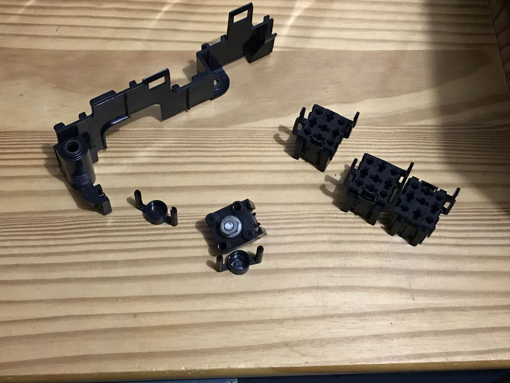

# BMW M70 engine relays #

- Main relay / Engine control module relay (2x)
  - Type: Reversed-polarity guard, normal opened contact, white
  - BMW Number: 61361729004

- Fuel pump relay
  - Type: normal opened contact, white green
  - BMW Number: 61368373700

## relays for usage with Proteus ##

- main relay: 6136 8373700 (white green, make contact)
  - one input (terminal 30)
  - two outputs (terminal 87)
- 2x bank relay, 6136 6915327 (sky blue, make contact)
  - one input (terminal 30)
  - two outputs (terminal 87)
- wire size:
  - B+ to 30: 2.5mm²
  - 87 to splice: 2.5mm²
  - splice to coils: 1.5mm²

## Aux relays ##
- white 1729004
- yellow 1389105

## Relay holder parts ##

- Relay holder, black white, BMW Number 6113 1389113
- Relay holder, black, BMW Number 6113 1389114

## Relay pins ##

- Double leaf spring contact 1.0mm² 6113 0007437
- Double leaf spring contact 2.5mm² 6113 0007438
- Double leaf spring contact 6.0mm² 6113 0007271
- Double leaf spring contact 0.5-1.0mm² (AG) 6113 8377730
- Double leaf spring contact 1.5-2.5mm² (AG) 6113 8377732
- Double leaf spring contact 4.0-6.0mm² (AG) 6113 8377734

