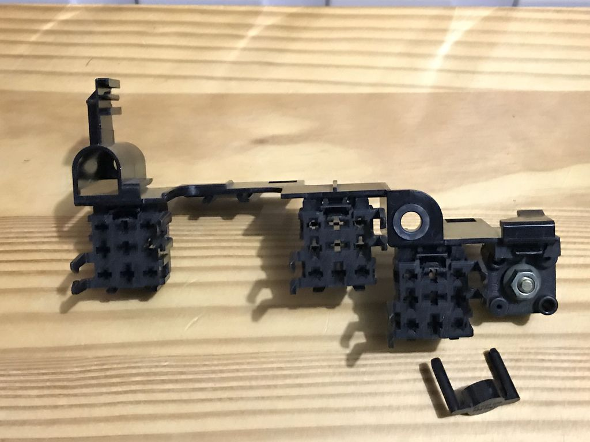

# BMW M70 engine relays #

- Main relay / Engine control module relay (2x)
  - Type: Reversed-polarity guard, normal opened contact, white
  - BMW Number: 61361729004

- Fuel pump relay
  - Type: normal opened contact, white green
  - BMW Number: 61368373700

## new relays for Proteus ##

- COP relays (2x)
  - Type: K6326, Relay, pine green
  - or Type K6327, white green
  - or Type K6539, sky blue
  - BMW Number: 6135 8350566 (pine green)
  - or BMW Number: 6136 8373700 (white green)
  - or BMW Number: 6136 6915327 (sky blue)
  - Pinning:
    - 85 GND
    - 86 Ignition switch, position 2 (X20, Pin.....)
    - 30 B+, 30A fused
    - 87 Power COP
- wire size:
  - B+ to 30: 2.5mm²
  - 87 to splice: 2.5mm²
  - splice to coils: 1.5mm²

## Relay holder parts ##

- Relay holder, black white, BMW Number 6113 1389113
	- Double leaf spring contact 0.5-1.0mm² (AG) 6113 8377730
	- Double leaf spring contact 1.5-2.5mm² (AG) 6113 8377732
	- Double leaf spring contact 4.0-6.0mm² (AG) 6113 8377734
- Relay holder, black, BMW Number 6113 1389114
	- Double leaf spring contact 1mm², BMW Number 6113 0007437
	- Double leaf spring contact 2.5mm², BMW Number 6113 0007438
