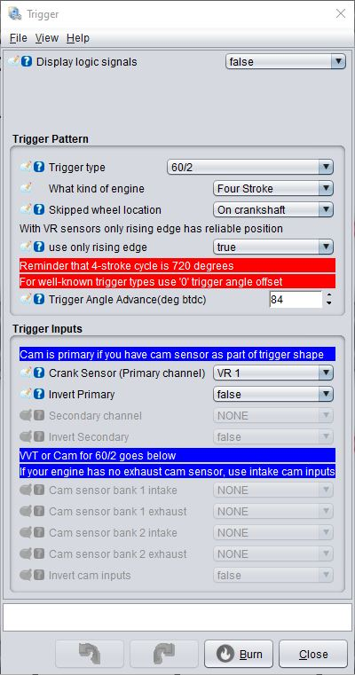

# Proteus trigger settings #

- Wheel type: 60/2 (60 teeth, 2 missing teeth)
- 1 tooth = 6°
- Trigger angle: 84° (means: if the first cylinder is on TDC, the distance between *sensor* and the *reference mark* is 84° or 14 teeth)

