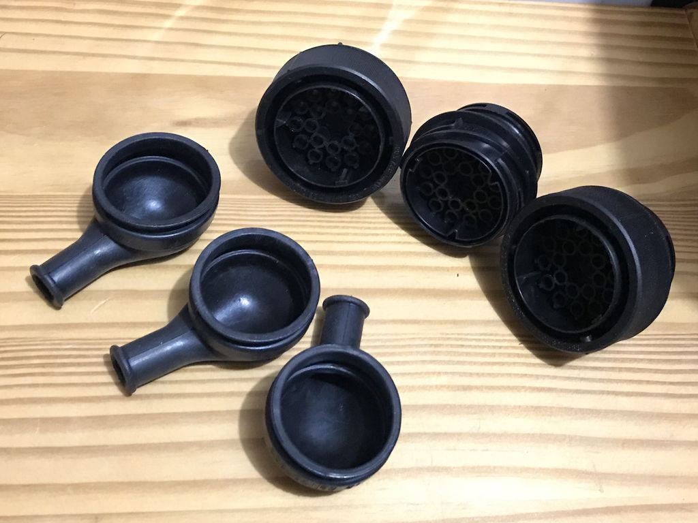

# X21 pinout

## X21 pinout, female on engine harness side

|Pin #|Name|Comes from|Goes to|Comment|
|-----|----|----------|-------|-------|
|1|PPS|Pedal position sensor X73.1|EML X6004.7|sensor value|
|2|PPS|EML X6004.1|Pedal position sensor X73.7, sensor value|5v voltage|
|3|PPS|EML X6004.9|Pedal position sensor X73.8, angle > 9°|5v voltage|
|4|PPS|Pedal position sensor X73.4|EML X6004.2|sensor ground|
|5|PPS|Pedal position sensor X73.8|EML X6004.46|voltage divider for angle > 9° switch|
|6|PPS|DME2 X6020.62|Pedal position sensor X73.2|5v, pedal status, depressed/released switch|
|7|A/C status signal||EML X6004.44|AUX fan 6454.0|
|8|A/C compressor on|Lock sensor ECU X77.5|EML X6004.41|Automatic climate control 6450.0|
|9|||||
|10|Brake pedal position|Brake switch X78.2|EML X6004.53||
|11|Clutch pedal position|EML X6004.54|Clutch swith X121.2|in auto cars X121.1 and .2 shorted and .2 is GND|
|12||Fuel pump relay 2, pin 87|P90, Fuse 24, Fuel pump 2|Power supply for fuel pump 2|
|13|Compressor cut-off signal|Compressor cut-off relay X10042.10|DME1 X6010.48|DME1 low side switch|
|14|||A2 instrument cluster, X16.3|Auxilary alternator|
|15|PPS|DME1 X6010.62|Pedal position sensor X73.5|5v, pedal status, depressed/released switch|
|16|Cruise control|EML X6004.43|cc switch X72.6|5v, cruise control switch|
|17|EML lamp 1|EML X6004.15|A2 instrument cluster, X16.7||
|18|EML lamp 2|EML X6004.15|A2 instrument cluster, X16.20||
|19|Cruise control|EML X6004.31|cc switch X72.5|GND cruise control switch|
|20|Injection signal 2|DME2, X6020.17|EKM X41.17|Injection signal 2 (ti signal 2)|
